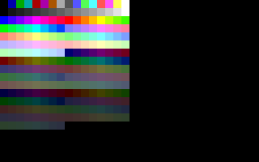

# DOS 8086 Assembly Demos

This repository contains a collection of very small and simple 8086 assembly
programs for MS-DOS type of computers. These programs perform a single task
which would normally be embedded into a larger program.

## Overview

* [helloworld](helloworld): Prints "Hello World!" to the screen
* [printdot](printdot): Enters VGA mode and prints all VGA colors in a 16 x 16 grid
* [fileio](fileio): Open a file and read its contents which is shown on the terminal screen
* [image](image): Load an image file and show it on the screen
* [crc16](crc16): Perform a CRC16 on a small snippet of data
* [savefile](savefile): Save a snippet of data to a file

## Screenshots

Screen shot of [printdot](printdot) program:



Screen shot of [image](image) program:


## Requirements

Install the required emulator and cross-compiler / assembler via the
instruction below.

```bash
sudo apt install -y dosbox bcc nasm build-essential
```

## Compiling and running

To compile and run any of the examples, go the respective folder and run

```bash
make && make run
```

## Scripts

The folder [vga-palette](vga-palette) contains a simple Python script to convert
`.png` files (24 bpp) to the VGA palette (8 bpp).